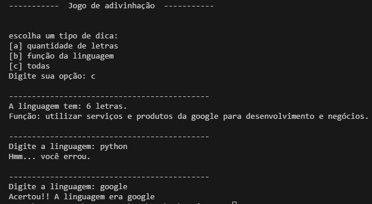

# Jogo para adivinhar a linguagem de programação.

* O usuário pode escolher qual o tipo de dica quer receber para depois tentar adivinhar.
* Após o erro ou acerto, aparece uma mensagem.
* Aprimorei esse script após assistir a Imersão IA da Alura com o Google.

